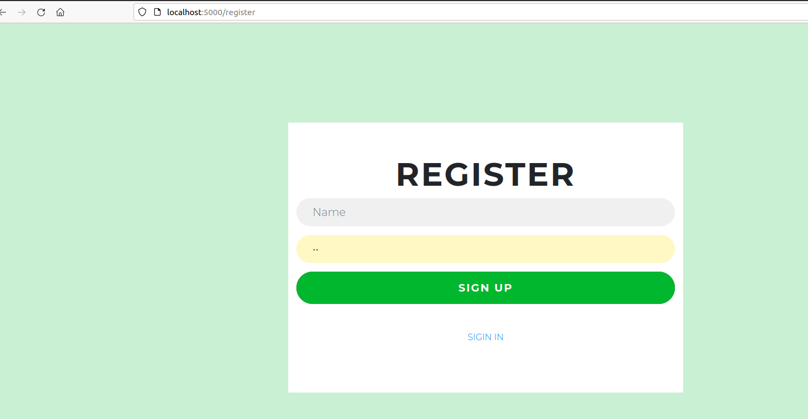
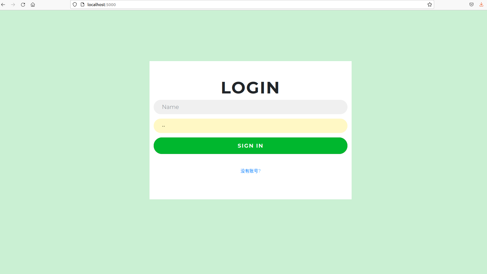
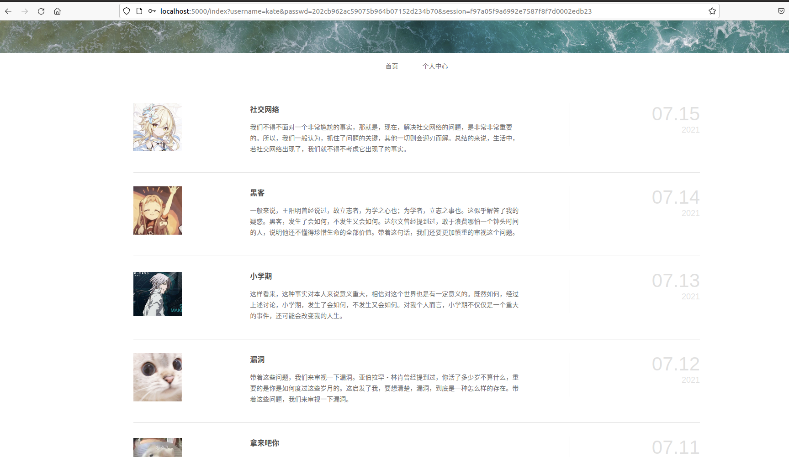
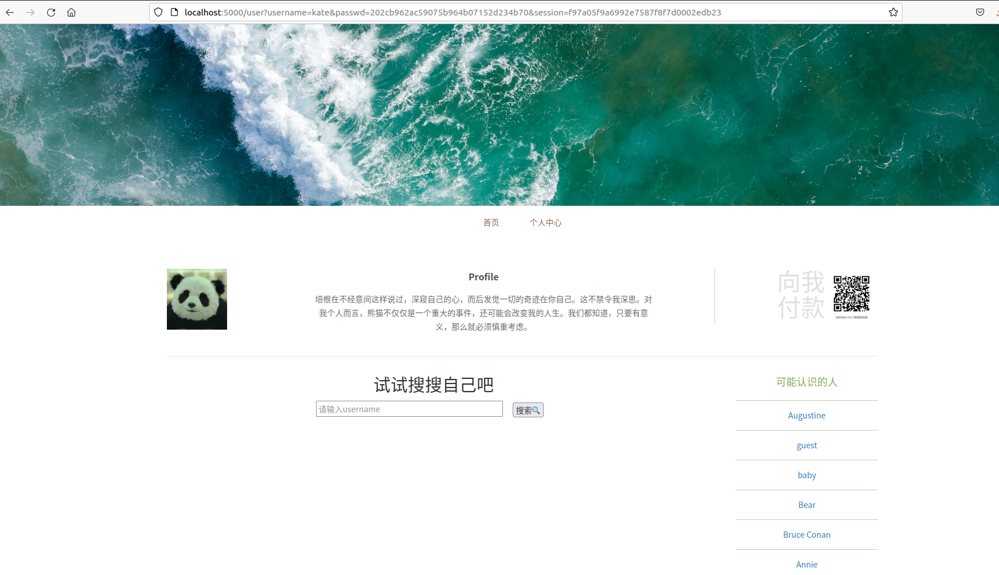
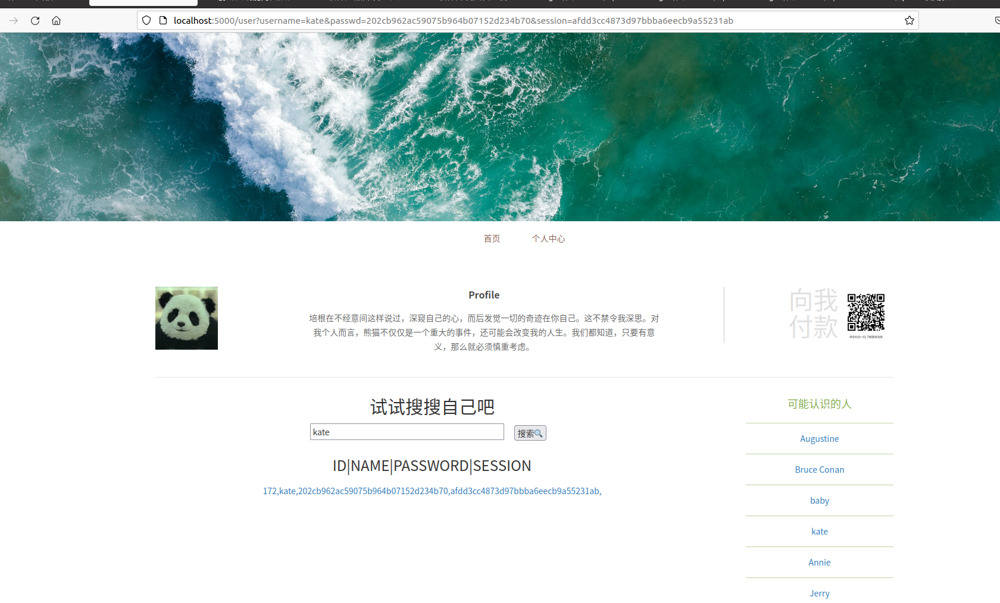

# 小组成员

王冬霞 张欣怡 马君瑞

# 需求分析

设计一个类似社交网站。包含注册界面、登录界面、主界面、个人详情界面；可以在个人主页侧边栏查看可能认识的人；可以通过搜索得到自己的用户名得到自己的相关信息。

#  漏洞利用链设计

+ 正常使用
  + 用户需要先进行注册、使用注册账号登陆；然后通过首页进入到个人主页。通过扫描页面的二维码得到需要提高权限的提醒。

+ 系统漏洞
  + 个人主页有可以搜索的输入框，在此进行`sql`注入，得到`admin`账号密码的`md5`哈希值和备注字段的一个`key`。
  + 通过`md5`爆破得到`admin`账号的密码,并使用`admin`账号登陆网页。

+ 漏洞利用点
  + 登录之后，扫描网页中的二维码，得到图片，通过之前得到的`key`提取图片得到`flag`。

# 技术选型

综合考虑上述的需求分析以及漏洞利用链的需求，我们最终选用下述技术栈进行开发：

+ 后端：`flask(python)`
+ 数据库: `mysql`
+ 前端：`javascript + html + css `
+ 运维：`Dockerfile + docker-compose`

技术选型具体原因如下：

+ 项目较小，`flask + mysql`足够支持整个项目。
+ 小组成员对`python + mysql + js +docker`有一定的基础，学习成本较低。
+ 使用`Dockerfile + docker-compose`交付项目已经是行业不成文的标准。

# 人员分工

| 项目                 | 负责人         | 参与人                                                       |
| -------------------- | -------------- | ------------------------------------------------------------ |
| 前端页面代码编写     | 马君瑞         | 马君瑞(登陆、注册、首页、个人主页的编写)、王冬霞(各页面跳转逻辑的编写、前端连接数据的编写) |
| 后端页面代码编写     | 王冬霞         | 王冬霞(`flask`编写后端逻辑、`docker`部署`mysql`)、张欣怡 (数据库表的创建、原始数据的插入) |
| 二维码相关的flag隐藏 | 张欣怡         | 张欣怡(调查相关的图像隐藏工具，进入flag嵌入、二维码生成的相关工作) |
| 运维交付             | 王冬霞         | 王冬霞(创建`web`端和`mysql`端镜像的`Dockerfile`的编写，启动服务的`docker-compose`的编写、镜像打包上传)、马君瑞(构建`web`和`mysql`端的`Dockerfile`的编写) |
| exp与check编写       | 王冬霞、张欣怡 | 王冬霞(`check`的编写、`exp`中：登陆、获取`session`、`sql`注入、得到`admin`密码、获取`admin`用户个人主页的二维码)、张欣怡(`exp`中：处理获取到的二维码，提取隐藏图片，从图片中提取`flag`) |
| 文档                 | 无             | 张欣怡、马君瑞、王冬霞（各自负责的部分）                     |

# 项目计划进度表

| 时间                       | 具体安排                                                     | 是否按时完成 |
| -------------------------- | ------------------------------------------------------------ | ------------ |
| 2021.7.15上午              | 确定大致的项目需求、漏洞利用链、创建`github`私有仓库、指定进度；学习`flask`和`mysql`相关内容 | 是           |
| 2021.7.15下午～2021.7.17晚 | 完成前后端、漏洞利用链的开发工作                             | 是           |
| 2021.7.18～2021.7.19       | 完成exp、check脚本编写；完成docker部署、初步完成文档         | 是           |
| 2021.7.20～2021.7.21       | 完善文档、最后的报告填写                                     | 是           |

# 页面逻辑

+ 注册

  

+ 登陆

  

+ 首页

  

+ 个人主页

  

+ 搜索自己得到自己相关的信息，猜测是数据库中的数据，怀疑此处有`SQL`注入。

  

  + 编写`SQL`注入代码，得到`admin`的密码(`md5`加密后的)和key字段；进行登陆；扫描二维码并得到图片；使用`steghide`提取`flag`(会用到数据库表中的key):

    ```bash
    steghide extract -sf 70acc53a08b04f2385ae27d382d62618.jpg
    ```

# 关键技术

## `SQL`注入实现与修复逻辑

将用户的输入和`SQL`查询语句直接拼接是非常危险的，经过实验，我们发现，使用`pymysql`的`cur.execute()`时，如果将用户的输入以变量的方式传入到该函数中，则该函数会作字符的转义工作。例如：当用户的`username`为`name'or'1'='1`时，直接拼接的`sql`语句为：`select * from Users where 3passwd2 = 'passwd' and session = 'session' and username = name'or'1'='1' `,数据库会返回Users表所有的信息！！！但是如果使用第二种方式，则`cur.execute()`会查询`username`为`name'or'1'='1`的用户，如果没该用户，则会返回空。

此处的预防逻辑完全可以通过自己进行字符过滤来实现，但是考虑到直接调用`cur.execute()`可以实现特殊字符的入库及查询以及自己编写的过滤难免有所疏忽，因此我们直接调用`cur.execute()`来`fix`我们的项目。

+ 存在`SQL`注入的后端代码：

  ```mysql
  @app.route('/myself',methods=['POST'])
  def getkey():
      session = request.form.get("session")
      username = request.form.get('username')
      passwd = request.form.get('passwd')
      if(username is None  or passwd is None or session is None):
          status = 209
          return json.dumps({"status" : status})
      sql = "select * from Users where 3passwd2 = '%s' and session = '%s' and username = '%s' "%(passwd,session,username)
      conn.ping(reconnect=True)
      cur = conn.cursor()
      try:
          lock.acquire()
          cur.execute(sql)
          lock.release()
          data = cur.fetchall()
          conn.commit()
          cur.close()
          return json.dumps({"status" : 208, "data" : data})
      except Exception as e:
          print( e )
          conn.rollback()
          cur.close()
      return json.dumps({"status":210})
  ```

+ 修复`SQL`注入的后端代码：

  ```python
  @app.route('/myself',methods=['POST'])
  def getkey():
      session = request.form.get("session")
      username = request.form.get('username')
      passwd = request.form.get('passwd')
      if(username is None  or passwd is None or session is None):
          status = 209
          return json.dumps({"status" : status})
      sql = "select * from Users where 3passwd2 = %s and session = %s and username = %s "
      params=(passwd,session,username)
      conn.ping(reconnect=True)
      cur = conn.cursor()
      try:
          lock.acquire()
          cur.execute(sql,params)
          lock.release()
          data = cur.fetchall()
          conn.commit()
          cur.close()
          return json.dumps({"status" : 208, "data" : data})
      except Exception as e:
          print( e )
          conn.rollback()
          cur.close()
      return json.dumps({"status":210})
  ```

# 运维

## 启动项目

**注意：如果本地5000端口被占用,可能导致服务启动失败**

+ [从`Dockerfile`构建](./documentation/Dockercompose构建说明文档)：

  >进入source目录，运行`docker-compose up`,访问：`localhost:5000`

+ [直接从镜像启动服务](./docker-compose.yml)（推荐：不依赖本除同级目录下的`docker-compose.yml`文件外的任何本仓库文件）：

  >+ 创建一个新目录并进入目录；
  >
  >  ```
  >  mkdir tmp
  >  cd tmp
  >  ```
  >
  >+ 创建`docker-compose.yml`文件，复制以下代码；
  >
  >  ```yml
  >  version: '3'
  >  services:
  >    fakebook:
  >      image: kate123wong/fakebook:1.0
  >      ports:
  >       - "5000:5000"
  >      depends_on:
  >       - db
  >      container_name: fakebook
  >      restart: always
  >    db:
  >      image: kate123wong/mysql:1.0
  >      command: --default-authentication-plugin=mysql_native_password
  >      environment:
  >        - MYSQL_ROOT_PASSWORD=6iuVhYwmxC
  >      restart: always
  >      container_name: mysql
  >  ```
  >
  >+ 命令行同级目录下，运行`docker-compose up`启动服务，浏览器输入：`localhost:5000`即可访问web前端

## 环境构建

+ `Dockerfile`构建`web`：

	```dockerfile
FROM ubuntu:18.04
RUN apt-get update
RUN DEBIAN_FRONTEND=noninteractive apt-get install -y -q python3 python3-pip 
#RUN python -m pip3 install --upgrade pip
RUN pip3 install --upgrade setuptools
ADD ./webapp/requirements.txt /tmp/requirements.txt
RUN pip3 install -qr /tmp/requirements.txt
ADD ./webapp /opt/webapp/
WORKDIR /opt/webapp
EXPOSE 5000
ENV LC_ALL=C.UTF-8
ENV LANG=C.UTF-8
CMD ["python3", "hello.py"]
	```

+ 从`Dockerfile`构建`mysql`：

	```dockerfile
  FROM mysql:5.7
  COPY data.sql /docker-entrypoint-initdb.d/data.sql
  # ENV MYSQL_ROOT_PASSWORD='6iuVhYwmxC'
  ENV MYSQL_DATABASE='socialcontact'
	```

+ `docker-compose`启动`web`服务和`mysql`服务：

	```yml
version: '3'
services:
  fakebook:
    build: web/.
    ports:
     - "5000:5000"
    depends_on:
     - db
    container_name: fakebook
    restart: always
  db:
    build: mysql/.
    command: --default-authentication-plugin=mysql_native_password
    environment:
      - MYSQL_ROOT_PASSWORD=6iuVhYwmxC
    restart: always
    container_name: kate123wongmysql
  
	```

+ 注：`dtata.sql`文件内容如下：

	```mysql
	use socialcontact;
	DROP TABLE IF EXISTS `Users`;
	/*!40101 SET @saved_cs_client     = @@character_set_client */;
	/*!40101 SET character_set_client = utf8 */;
	CREATE TABLE `Users` (
  `uid` int(11) NOT NULL AUTO_INCREMENT,
  `username` varchar(30) NOT NULL,
  `3passwd2` text CHARACTER SET latin1,
  `session` text CHARACTER SET latin1,
  `remark` text CHARACTER SET latin1,
  PRIMARY KEY (`uid`),
  UNIQUE KEY `username_UNIQUE` (`username`)
	) ENGINE=InnoDB AUTO_INCREMENT=172 DEFAULT CHARSET=utf8;
	LOCK TABLES `Users` WRITE;
	/*!40000 ALTER TABLE `Users` DISABLE KEYS */;
	INSERT INTO `Users` VALUES (148,'Annie','92a0a2d55d3e38a1de90afffb9d0f848',NULL,NULL),(149,'mio','4677c0f38c1965cbe08bb46d634bdc04',NULL,NULL),(150,'Augustine','79c3826917efc4e7dcee28d288986d13',NULL,NULL),(151,'Karam','e0f99b2e29cfce1fabeb7732e24847a4',NULL,NULL),(152,'Roscoe','59ce82bfa0a22be8bb184255ccb48c9e',NULL,NULL),(153,'baby','942bc87c671b46809965218a1af8bb35',NULL,NULL),(154,'Bear','f779bf0451f98f6c8b4f89a5f3ee80b6',NULL,NULL),(155,'Burke','0418ef425350b8046c9b3e500efb4532',NULL,NULL),(156,'Timmy','accc9105df5383111407fd5b41255e23','fef7f0455a7c21cf13b62ffd060086c7',NULL),(157,'Xenia','22de8fe317b2ce41324a80c3ceb34904',NULL,NULL),(158,'Bruce Conan','0a592194880f10272b8e7d4ea54d8dd6',NULL,NULL),(159,'Will Pearson','2e38d34a2053dcb1ab4517859704ad65',NULL,NULL),(171,'admin','1164f9e5b8cef768396dcd5374e4b6eb','0098b35216c7a270a03688c09ba1244b','key:YkZ0VFBSbHBTMVZUODFia1R0eEU=');
	/*!40000 ALTER TABLE `Users` ENABLE KEYS */;
	UNLOCK TABLES;
	```
