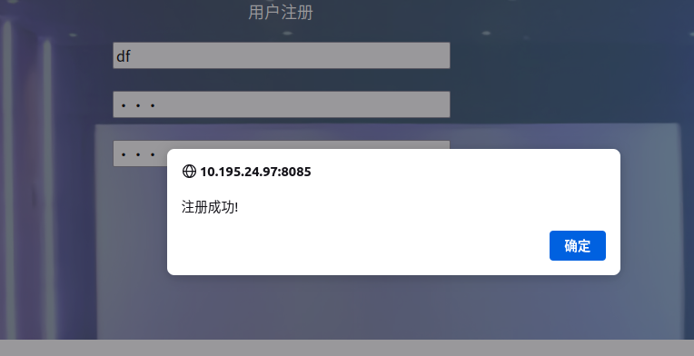
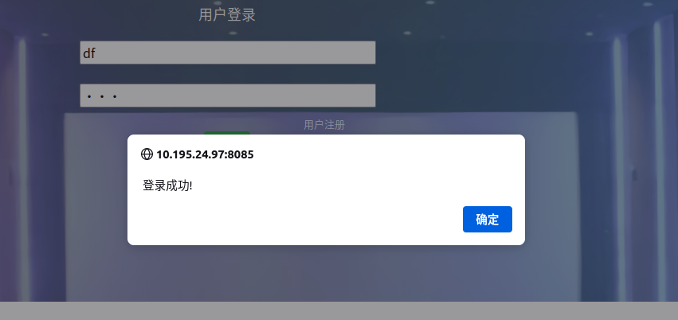

ip：10.195.24.97

使用namp扫描：


访问:http:10.195.24.97:8085

得到一个登陆界面


随意输入密码，提示登陆失败（应该有真实的后端）


进行注册，并使用注册的账号登陆。





得到一个有8张图片的页面：


最后一张图有些端涅，下载观察：


分离zip文件

打开zip压缩包得到一个falg.txt，内容如下：

```
VGhlIGJlZ2lubmluZyBpcyB0aGUgZW5kLgpUaGUgZXh0cmFjdGluZyBwYXNzd29yZCBpcyBpbiBkOi9wYXNzd29yZC50eHQgaW4gbXkgY29tcHV0ZXIsIGNhbiB5b3UgZ2V0IGl0Pw==
```

base64解码，得到：

```
The beginning is the end.
The extracting password is in d:/password.txt in my computer, can you get it?
```

