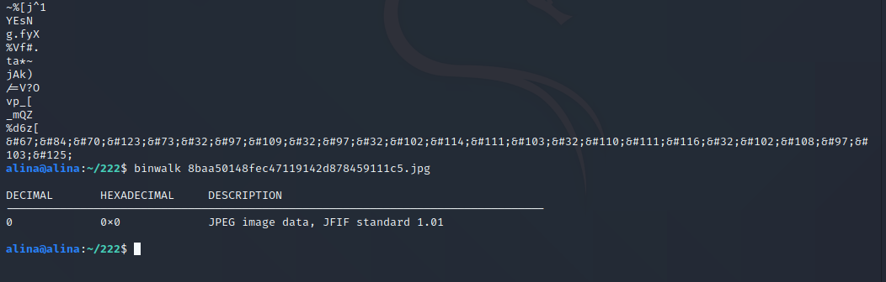

## 二维码构思文档  
### 普通用户权限  
二维码效果：  
  
手机扫描为小青蛙图片，二维码扫描工具扫描即可获得jpg网址  
  
进入网址将jpg图片保存到本地  
  
将jpg文件传入Kali，用binwalk看不出任何端倪，用strings查看还会发现结尾附了一小段Unicode编码，解码后内容为`CTF{I am a frog not flag}`  
  
### admin用户权限  
二维码效果：  
