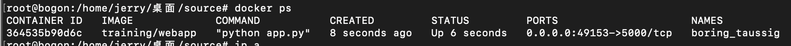
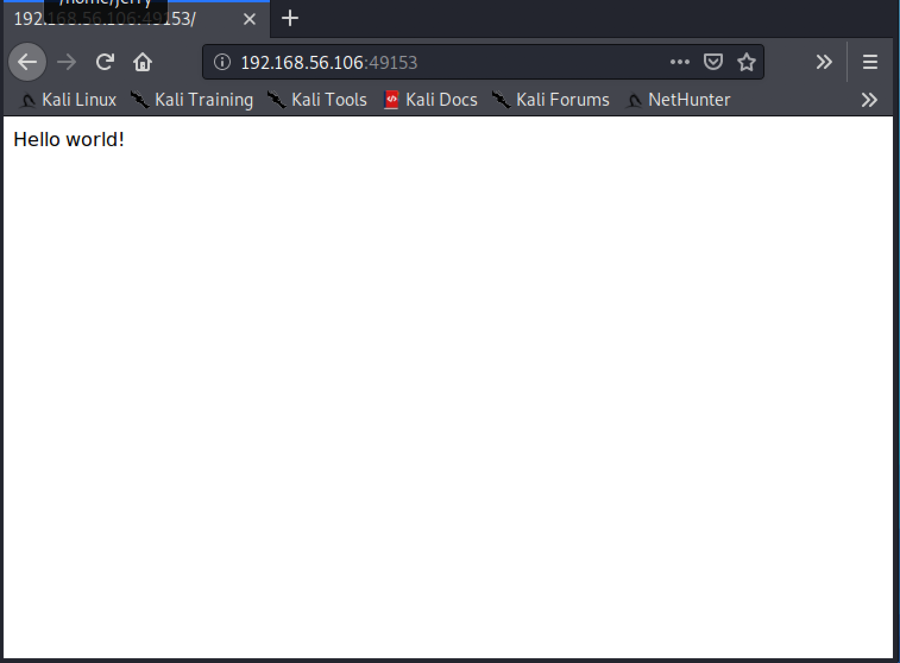

# Docker

## 构建镜像

>  Dockerfile

目标：构建可以运行的docker镜像

From：ubuntu18.04

- web服务：可参考docker官方维护的[Training/Webapp](https://github.com/docker-training/webapp)
- 数据库服务：docker官方mysql镜像`docker search mysql`

#### 能否构建一个镜像可以同时提供以上两种服务?

> start.sh

用于构建镜像时启动服务，在Dockerfile中调用：

`ADD ./start.sh /etc/my_init.d/`

`RUN chmod u+x /etc/my_init.d/start.sh`

## 编译、启动镜像

- 编译

  示例中提示**最好将数据库等服务与web服务放在同一容器中**

  > docker-compose.yml

- 启动

  `docker-compose up -d --build `

## 测试

在kali2020.3中试构建基于Training/Webapp镜像的容器并运行简单的python脚本

(该镜像的基础镜像为ubuntu14.04)

` docker pull training/webapp`

`docker run -d -P training/webapp python app.py`

`docker ps`查看

在kali浏览器中打开*192.168.56.106:49153*

