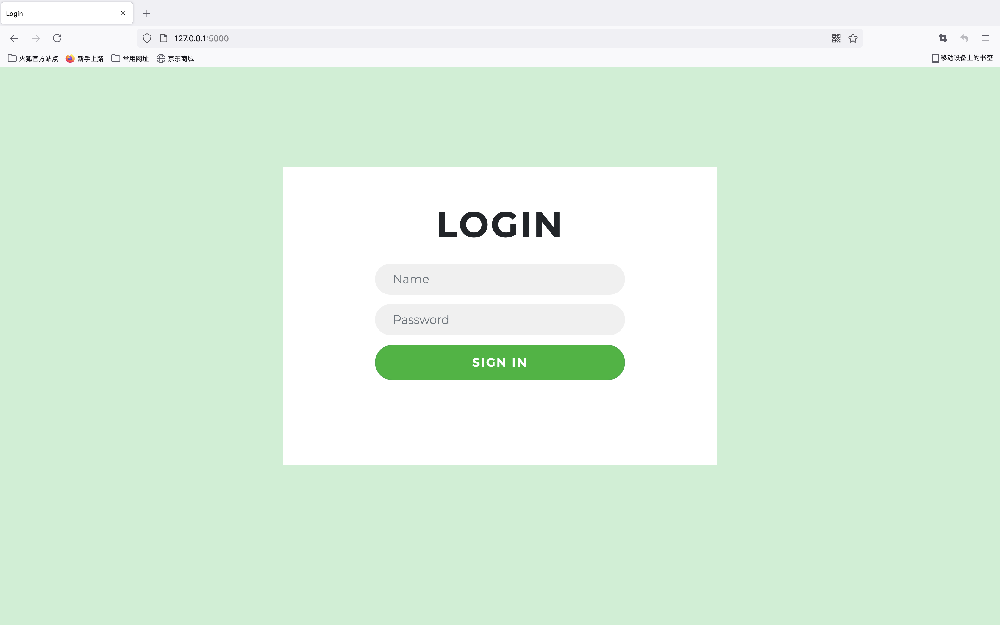
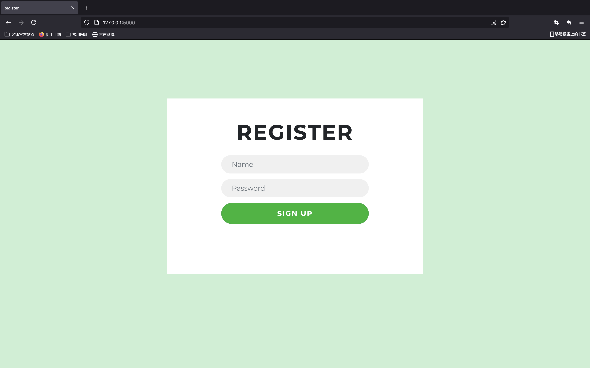
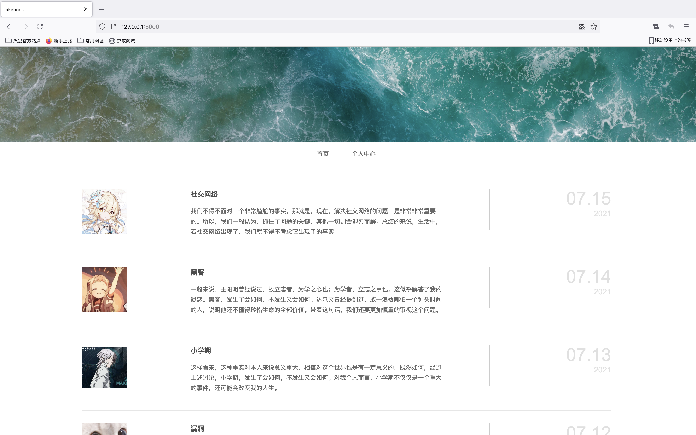
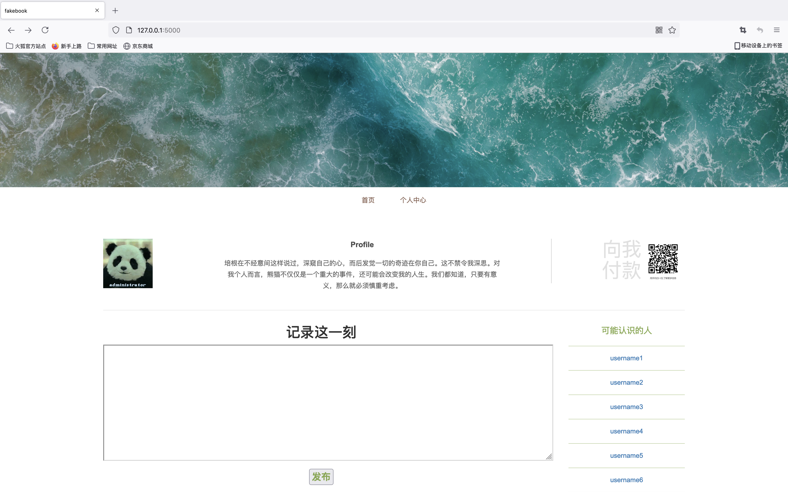
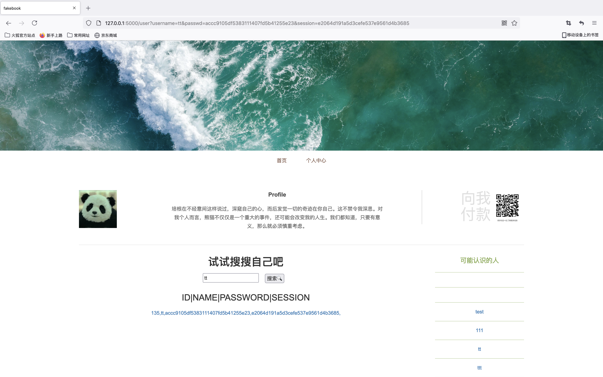
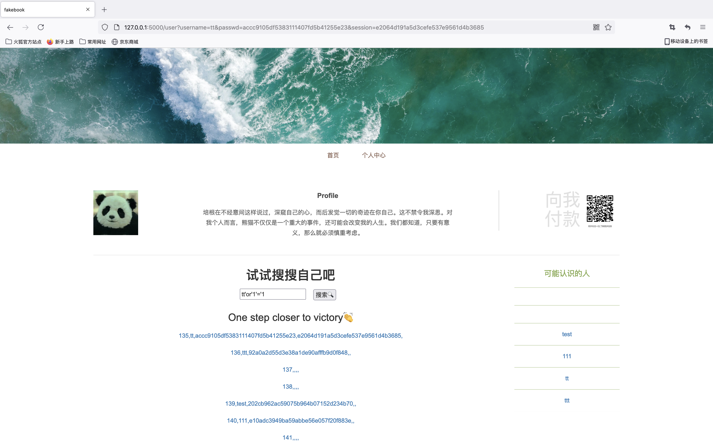

# flask测试样例

## 结构说明

**static**存放网页所需的css、js等

**templates**存放.py和.html

**login.html**登陆界面

**register.html**注册界面

**index.html**首页界面

**templates/admin**存放admin用户的个人主页index.html

**admin/index.html**个人主页界面，破解后可见

**user/index.html**个人主页界面及三个搜索

- 搜自己

  

- 搜别人

  

- 注入

  

