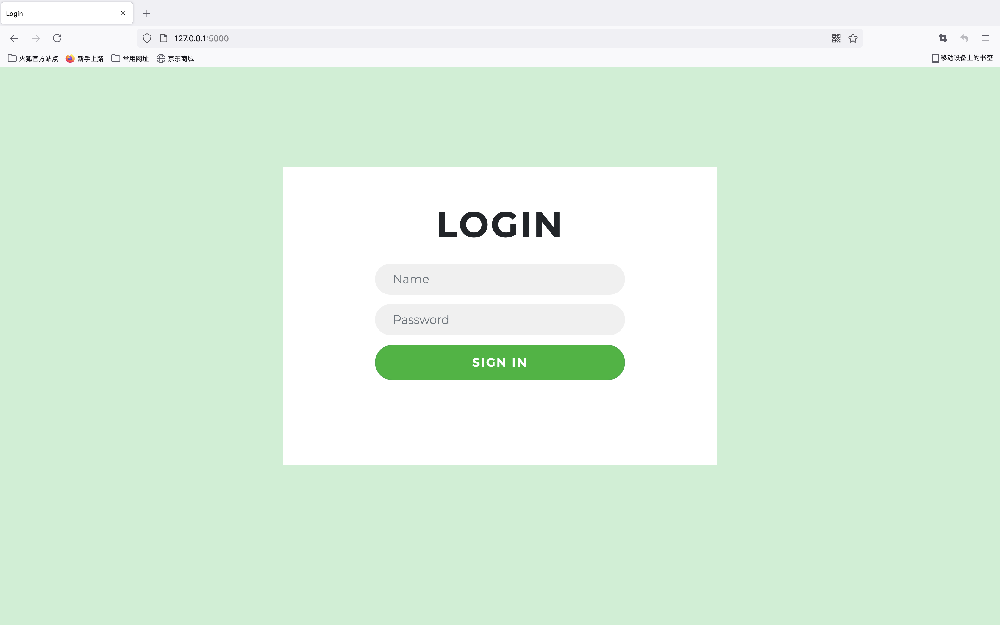
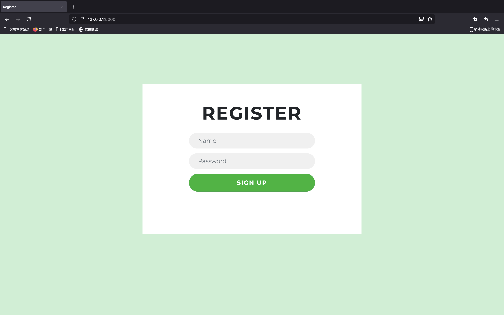

# flask测试样例

## 结构说明

**static**存放网页所需的css等

**templates**存放.py文件和主要html

**login.html**登陆界面

**register.html**注册界面

**index.html**首页界面，用户登录后可见

**hello.py**调用admin.html的测试样例，执行时cd到test目录下然后

`export FLASK_APP=hello`

`flask run`

**templates/admin**存放admin用户的个人主页index.html

**templates/user**存放一般用户的个人主页index.html

## 需求分析

- login.html需要增加用户名或密码错误的判断
- register需要增加用户名已被使用的判断，暂时不考虑密码健壮性问题

> 或者就是说去掉注册环节，直接在登录界面增加一个「用户名单」（除了admin），让解题者认为能暴力破解，增加可玩性

- 首页标题与内容待填写
