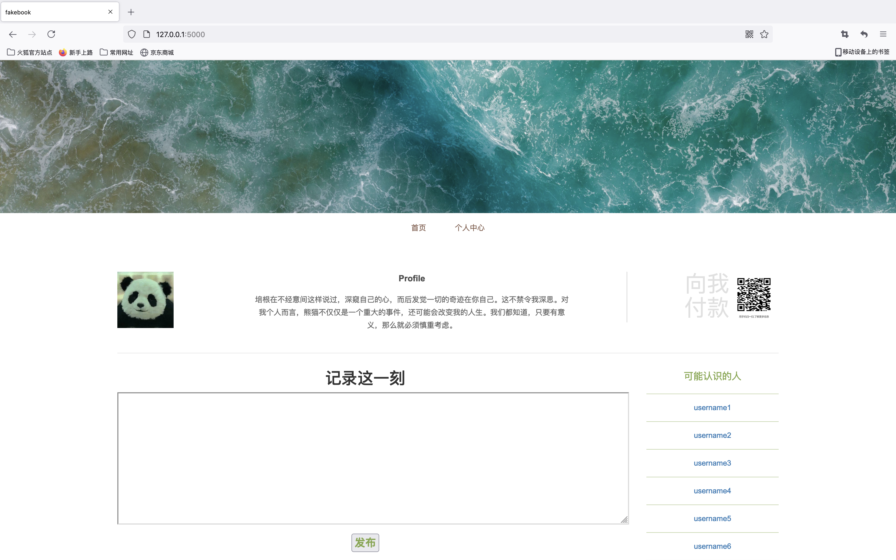

# flask测试样例

## 结构说明

**static**存放网页所需的css、js等

**templates**存放.py和.html

**login.html**登陆界面

**register.html**注册界面

**index.html**首页界面

<<<<<<< HEAD

=======

>>>>>>> development

**test.py**调用html的测试样例，执行时cd到test目录下然后

`export FLASK_APP=test`

`flask run`

**templates/admin**存放admin用户的个人主页index.html

**admin/index.html**个人主页界面，破解后可见

**user/index.html**个人主页界面，用户登录后可见

## 需求分析

